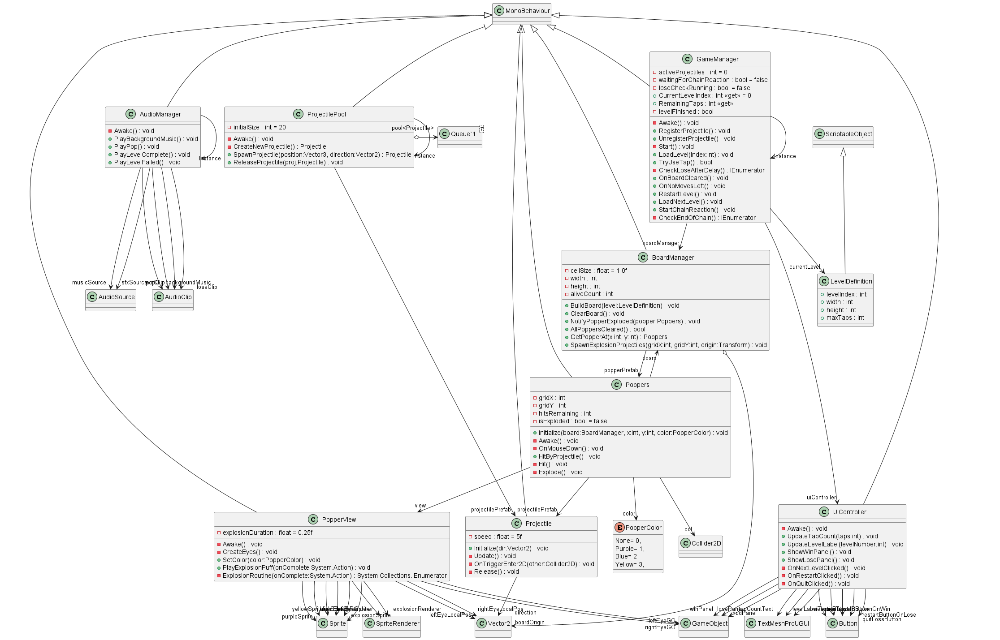

# 🎮 Crazy Poppers  
*A Chain Reaction Puzzle Game Built in Unity*

---

## 📌 Overview  
**Crazy Poppers** is a chain-reaction based puzzle game inspired by *Crazy Popper* mechanics.  
Your goal is to clear the board by smartly using a limited number of taps.  
Each tapped popper triggers state changes or explosions that launch projectiles in four directions, creating satisfying chain reactions.  

---

## 🧩 Gameplay Mechanics  

| Popper Color | Hits Required | Next State | Final Action |
|--------------|---------------|------------|---------------|
| 🟪 Purple     | 1             | Explodes   | Launches projectiles |
| 🔵 Blue       | 2             | Purple     | Eventually explodes |
| 🟡 Yellow     | 3             | Blue       | Eventually explodes |

**Explosion Rules:**
- Exploded poppers launch **projectiles** in **4 directions** (Up, Down, Left, Right).
- Projectiles hit next poppers → apply hit logic.
- Projectiles stop only when:
  - They hit a popper, or
  - Exit the game board.

**Win Condition:**  
✔ All poppers are successfully removed from the board.

**Lose Condition:**  
❌ No taps remaining *after chain reaction ends* and poppers still exist.

---

## 🕹 Controls  
| Action | Input |
|--------|--------|
| Tap popper | Left Mouse Click / Touch |
| Restart level | Restart button |
| Next level | Next button (after win) |
| Open settings | Menu/Settings button |

---

## 📁 Project Structure

Assets/
├── Art/
├── Audio/
├── Prefabs/
│ ├── Popper.prefab
│ └── Projectile.prefab
├── Scripts/
│ ├── Core/
│ │ ├── GameManager.cs
│ │ ├── BoardManager.cs
│ │ └── LevelDefinition.cs
│ ├── Gameplay/
│ │ ├── Popper.cs
│ │ └── Projectile.cs
│ └── UI/
│ ├── UIManagerUITK.cs
│ ├── MainMenu.uxml
│ ├── HUD.uxml
│ ├── Settings.uxml
│ ├── WinPanel.uxml
│ ├── LosePanel.uxml
│ └── GameTheme.uss
└── Scenes/
└── Game.unity

---

## 🧠 Technical Features  

### ✔ Data-Driven Levels  
- Uses **ScriptableObject (LevelDefinition)** for level creation  
- Designers can build new levels without modifying code  

### ✔ Generic Popper Setup  
- Single prefab handles all color states  
- Eyes attach automatically via code  

### ✔ Projectile System  
- Supports **object pooling** for performance (optional)  
- Clean hit & chain logic  

### ✔ Strong Architecture  
- Easy to expand  
- No hardcoded grid  
- Safe chain reaction logic to avoid infinite loops  

### ✔ Modern UI  
Built using **Unity UI Toolkit** (UXML + USS) with:  
- Main Menu  
- HUD  
- Settings  
- Win Panel  
- Lose Panel  

---

## 🔊 Audio Events

| Event | Clip |
|--------|-------|
| Pop | `pop3.mp3` |
| Level Complete | `applauseShort.mp3` |
| Level Failed | `awh.mp3` |
| Background Music | `poppersBackgroundMusic.mp3` |

---

## 🚀 How To Play (Developer)

1. Open Unity (2021 or newer recommended)
2. Load **Game.unity** scene
3. Press **Play**
4. Press **Start** in the UI to begin

To add new levels:  
`Right-click → Create → CrazyPoppers → LevelDefinition`

Configure:
- Width / Height  
- Grid Array (popper layout)  
- Allowed taps  

---

## 🧪 Known Test Cases

| Scenario | Expected Result |
|-----------|----------------|
| Tap until zero taps remain | Lose (after reaction end) |
| Single smart tap chain clears board | Win |
| Click Blue popper twice | Turns Purple → Explodes |
| Projectile hits Yellow | Yellow → Blue |

---

## 🛠 Future Enhancements  

| Feature | Status |
|----------|--------|
| Multiple themes / skins | ⏳ |
| Power-ups (bomb/freeze/mega blast) | ⏳ |
| Haptics (mobile) | ⏳ |
| Level unlock progression | ⏳ |
| Animated popper faces | ⏳ |
| WebGL export | ⏳ |

---

## 🏁 Summary  
This project demonstrates:

- Puzzle system thinking  
- Chain-reaction gameplay  
- Clean, modular programming  
- UI Toolkit usage  
- Data-driven level building  
- Audio-integrated interactions  

Perfect foundation for casual puzzle game expansion.

---

## 📜 License  
For assessment and showcase purposes only.  
Not intended for commercial release without asset rights.

---

